<div align="center">


<br />
<br />


<h1>🍏 FitAdvisor AI</h1>

<p><strong>Your personal AI-powered fitness & nutrition coach — built with Flutter, Node.js, and Google Gemini.</strong></p>

<p><em>Snap a meal. Get insights. Hit your goals.</em></p>

<br />

[✨ Features](#-features) • [🛠 Tech Stack](#-tech-stack) • [📂 Project Structure](#-project-structure) • [🚀 Getting Started](#-getting-started) • [🎨 Design](#-design) • [🤝 Contributing](#-contributing)

<br />

> **Status:** ✅ Actively maintained &nbsp;|&nbsp; 🧪 Open for contributions

</div>

---

## ✨ Features

| | Feature | Description |
|---|---|---|
| 🧠 | **AI-Powered Insights** | Personalized nutrition and fitness advice via Google Gemini |
| 📸 | **AI Food Analysis** | Snap a photo of any meal for instant macro & calorie breakdown |
| 🍽️ | **Meal Tracking** | Log meals, monitor dietary progress, and delete entries on the fly |
| 💬 | **Conversational Interface** | Chat-based UI for seamless interaction with your AI coach |
| 🔒 | **Secure Authentication** | Google & Apple Sign-In with server-side JWT verification |
| 📅 | **Calendar Integration** | Schedule and monitor fitness routines with a clean calendar view |
| 🎨 | **Premium UI/UX** | Lottie animations, shimmer effects, custom fonts & slidable panels |
| 🌙 | **Data Persistence** | Secure token & settings storage via `shared_preferences` |

---

## 🛠 Tech Stack

### 📱 Frontend — Flutter

| Category | Package |
|---|---|
| **Framework** | Flutter `^3.6.0` |
| **State Management** | GetX `^4.6.6` |
| **AI Integration** | `flutter_gemini`, `google_generative_ai` |
| **Authentication** | `google_sign_in`, `sign_in_with_apple` |
| **UI / Animations** | `lottie`, `shimmer`, `flutter_slidable`, `font_awesome_flutter`, `auto_size_text`, `flutter_svg` |
| **Calendar** | `table_calendar` |
| **Networking & Data** | `http`, `intl`, `shared_preferences`, `flutter_dotenv` |

### 🖥 Backend — Node.js

| Category | Package |
|---|---|
| **Server** | Express.js `^5.2.1` |
| **Database** | MongoDB via Mongoose `^8.23.0` |
| **AI Integration** | `@google/genai` `^1.44.0` |
| **Authentication** | `jsonwebtoken`, `bcryptjs`, `google-auth-library`, `apple-signin-auth` |
| **Security** | `cors`, `dotenv` |

---

## 📂 Project Structure

```
fitadvisor-ai/
│
├── 📱 lib/                          # Flutter application
│   ├── controllers/                 # GetX state controllers
│   ├── models/                      # Data models
│   ├── screens/                     # App screens & pages
│   ├── widgets/                     # Reusable UI components
│   └── services/
│       ├── backend_service.dart     # API communication layer
│       └── shared_prefs_service.dart # Local storage service
│
├── 🖥 backend/                      # Node.js server
│   ├── controllers/                 # Request handling & logic orchestration
│   │   └── historyController.js
│   ├── services/                    # Business logic & external integrations
│   │   └── aiService.js
│   ├── routes/                      # Express endpoint definitions
│   ├── models/                      # Mongoose schemas
│   └── db/                          # Database configuration
│
├── .env                             # Flutter environment variables
├── backend/.env                     # Backend environment variables
└── README.md
```

---

## 🚀 Getting Started

### Prerequisites

- [Flutter SDK](https://docs.flutter.dev/get-started/install) `>=3.6.0`
- [Node.js](https://nodejs.org/) `>=18.x`
- [MongoDB](https://www.mongodb.com/) — local instance or Atlas cluster
- Google Gemini API key → [Get one here](https://makersuite.google.com/)
- Google & Apple OAuth credentials configured

---

### 1. Clone the Repository

```bash
git clone https://github.com/samimalikdev/fitadvisor-ai.git
cd fitadvisor-ai
```

---

### 2. Backend Setup

```bash
cd backend
npm install
```

Create a `.env` file inside `/backend`:

```env
PORT=5000
MONGODB_URI=your_mongodb_connection_string
JWT_SECRET=your_jwt_secret_key
GEMINI_API_KEY=your_gemini_api_key
```

Start the server:

```bash
npm start
```

> Server runs at `http://localhost:5000`

---

### 3. Flutter Setup

From the project root:

```bash
flutter pub get
```

Create a `.env` file in the Flutter project root:

```env
API_BASE_URL=http://localhost:5000
```

Run the app:

```bash
flutter run
```

> ⚠️ Make sure your backend is running and accessible before launching the app.

---

## 🎨 Design

FitAdvisor AI uses a premium **"dark abyss"** aesthetic — built for a futuristic health and AI experience.

- **Background:** `#060818` — deep space black
- **Accents:** Vibrant neon glows for interactive elements
- **Motion:** Lottie animations + shimmer loading states
- **Layout:** Smooth slidable panels for an intuitive, gesture-first experience

Every screen is designed to feel less like a utility app and more like a premium product.

---

## 🎬 Demo

### 📹 Full App Walkthrough

<div align="center">
  <a href="https://youtu.be/FiPkylupS_E?si=Q2RMhLhAcIOGGdpk">
    
  </a>
  <p><b>🎥 Click to watch the complete feature demonstration</b></p>
  <p><i>See all features in action: AI Food Analysis, Meal Tracking, Fitness Coaching, and more!</i></p>
</div>

---

## 📸 Screenshots

<p align="center">
  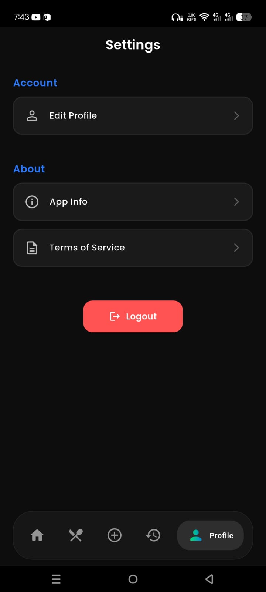
  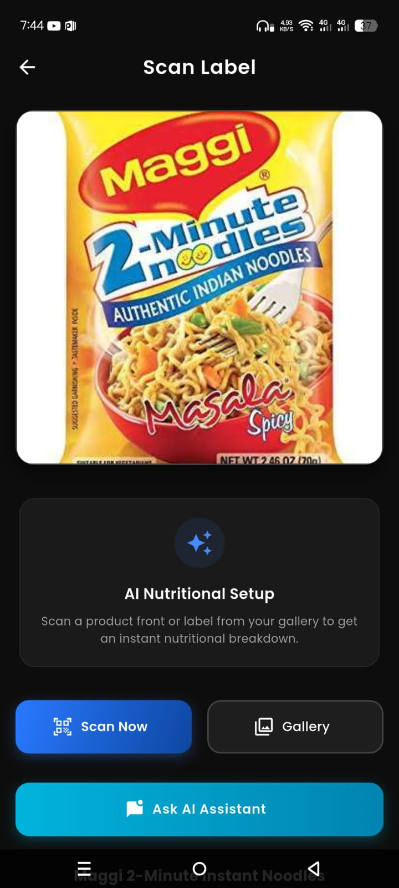
  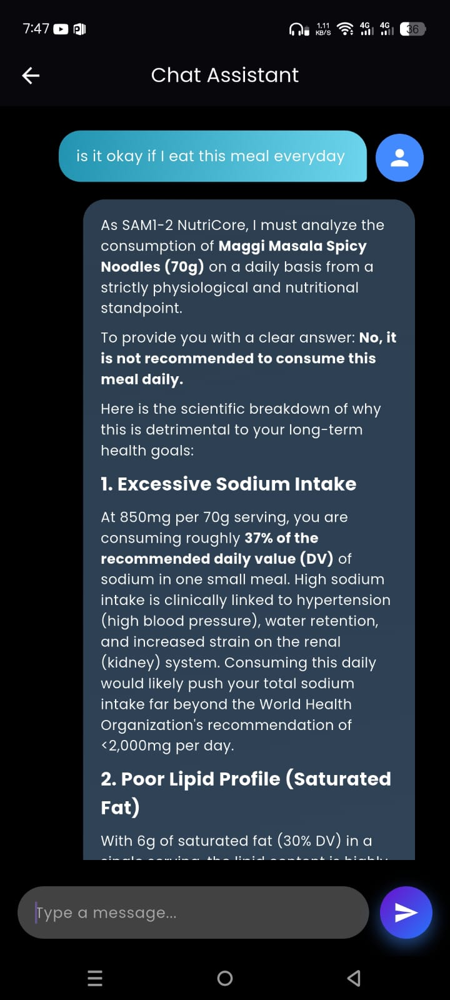
</p>

<p align="center">
  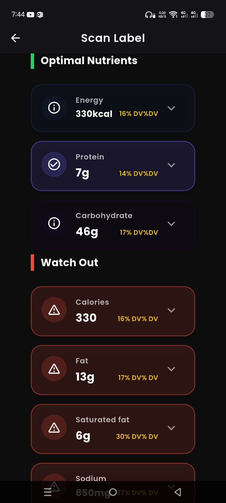
  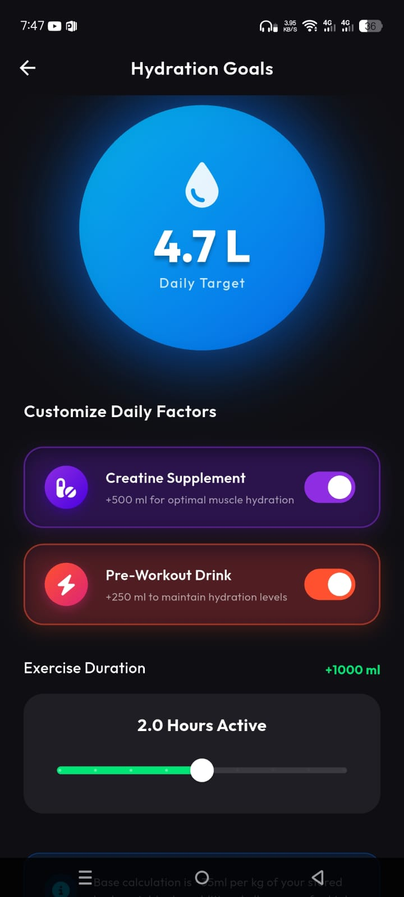
  
</p>

<p align="center">
  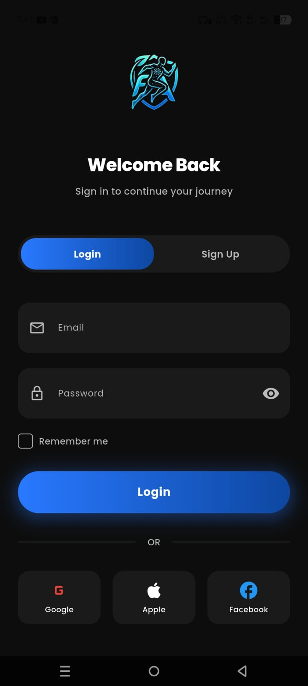
  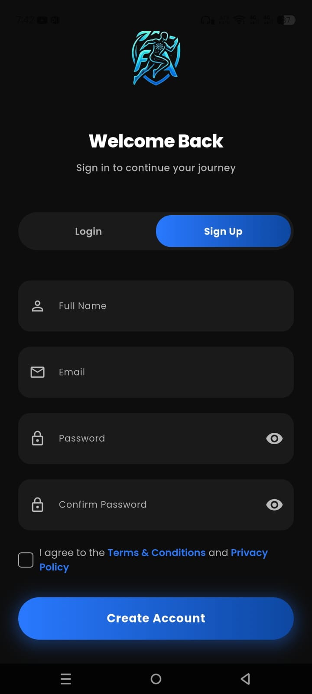
  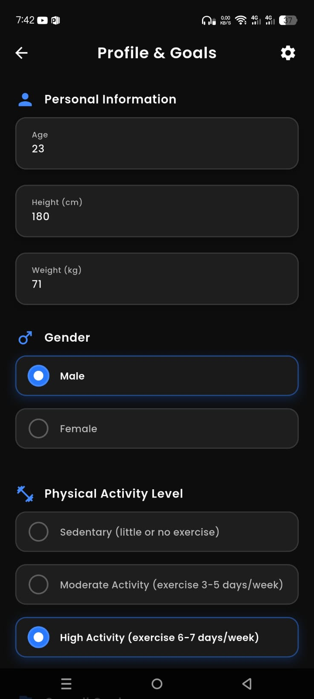
</p>

<p align="center">
  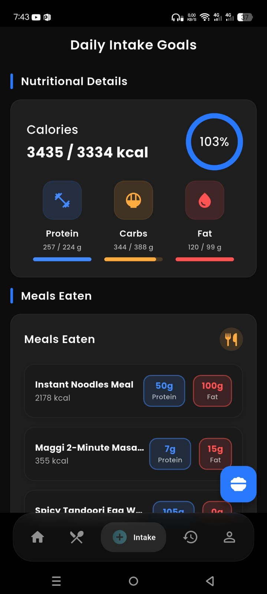
  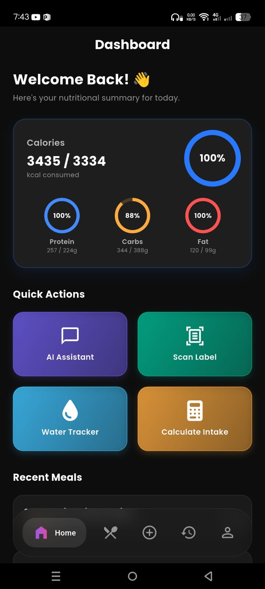
  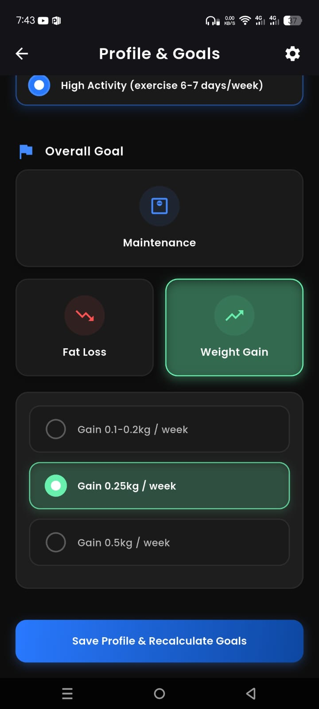
</p>

<p align="center">
  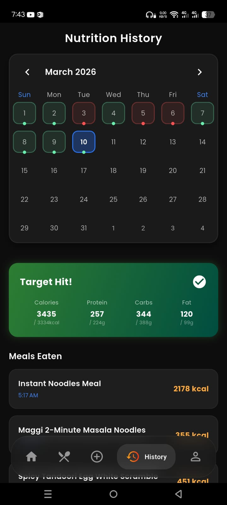
  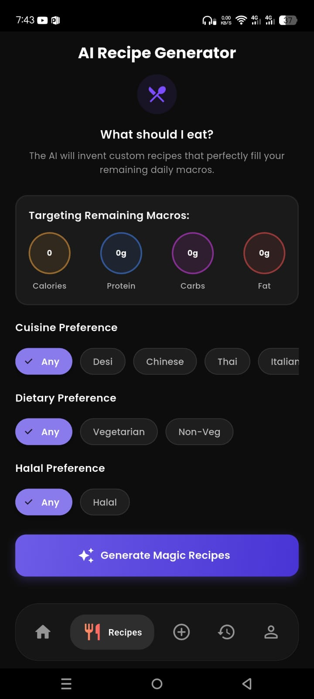
</p>

---

## 🤝 Contributing

Contributions, issues, and feature requests are welcome!

1. Fork the repository
2. Create your branch: `git checkout -b feature/your-feature`
3. Commit your changes: `git commit -m 'feat: add your feature'`
4. Push to the branch: `git push origin feature/your-feature`
5. Open a Pull Request

Please check the [issues page](../../issues) for open tasks.

---

## 📄 License

Distributed under the MIT License. See [`LICENSE`](LICENSE) for details.

---

<div align="center">

Built from scratch. Abandoned. Finished anyway. 💚

If this helped you, drop a ⭐ — it means a lot.

</div>
